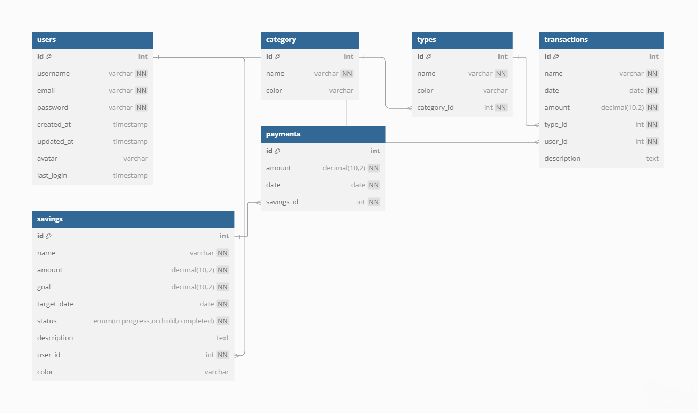

# 🚀 Backend for Expense Tracker App

This is the backend for the **Expense Tracker App**, built with **Django Rest Framework (DRF)** and **PostgreSQL**. The API provides comprehensive tools to manage personal finances, including tracking income and expenses, setting savings goals, creating budgets, and generating financial insights.

---

## 📑 Table of Contents

- [🔗 Frontend Repository](#-frontend-repository)
- [📋 Features and Functionality](#-features-and-functionality)
- [🛠️ Technologies Used](#-technologies-used)
- [💾 Database Schema](#-database-schema)
- [🔧 Installation](#-installation)
- [📚 API Documentation](#-api-documentation)

---

## 🔗 **Frontend Repository**

The frontend for this application is located in a separate repository. You can access it here:  
👉 [Frontend Repository Link](https://github.com/jovana623/expense-tracker)

---

## 📋 Features and Functionality

### **Core Features**:

- **Transaction Management**:
  - Track income and expenses.
  - Categorize and filter transactions.
  - CRUD operations for transactions.
- **Savings Tracking**:
  - Set savings goals with target amounts and deadlines.
  - Monitor progress with status updates (e.g., _in progress_, _on hold_, _completed_).
- **Budgets and Spending**:
  - Create monthly/yearly budgets and track usage.
  - Generate insights on spending by category or type.
- **Statistics & Calendar**:
  - Summarized insights (monthly/yearly trends, top categories).
  - Calendar view for transactions.
- **Default Categories**:
  - Predefined categories like _Income_ and _Expense_ to simplify setup.
- **JWT Authentication**:
  - Secure user login with token-based authentication (JWT).
  - Authentication endpoints are set up, but the frontend is not yet integrated.

---

## 🛠️ Technologies Used

- **Backend Framework**: Django Rest Framework (DRF)
- **Database**: PostgreSQL
- **Authentication**: JSON Web Tokens (JWT)

---

## 💾 Database Schema

Below is the database schema for the Expense Tracker App:

- **Users Table**: Stores user credentials and information.
- **Categories Table**: Defines categories for transactions (e.g., income, expenses).
- **Transactions Table**: Stores transaction details linked to users and categories.
- **Savings Table**: Defines savings goals and their progress.
- **Payments Table**: Tracks payments made towards savings goals.

---

## 📚 API Documentation

### **Key Endpoints**

#### **Authentication**

- `POST /register/`  
  Register a new user.
- `POST /token/`  
  Obtain JWT tokens.
- `POST /token/refresh/`  
  Refresh access token.

#### **Transactions**

- `POST /create_transaction/`  
  Add a new transaction.
- `GET /transactions/`  
  List all transactions.
- `GET /transactions/<id>/`  
  Retrieve, update, or delete a specific transaction.

#### **Savings**

- `POST /create_saving/`  
  Create a new saving goal.
- `GET /savings/`  
  List all saving goals.
- `GET /savings/<id>/`  
  Retrieve, update, or delete a saving goal.

#### **Statistics**

- `GET /statistics/`  
  View financial summaries (e.g., top income/expense types, averages).

---
